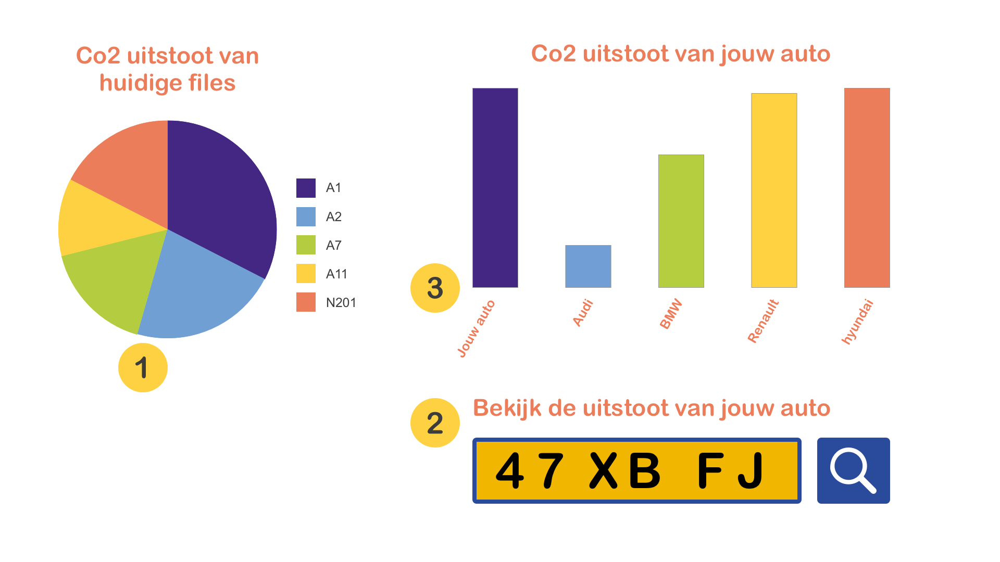
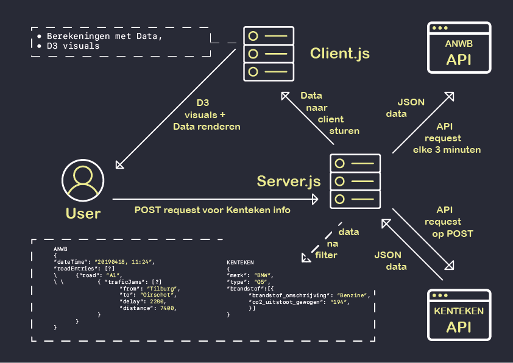

# Real-Time Web @cmda-minor-web · 2018-2019

#### werkruimte:

Tijdens dit project wordt er gewerkt in branches. Kijk voor meer detail van code naar de diverse branches.

## Concept:

Het idee wat ik bedacht heb voor de komende week is een website waar je de huidige files op de Nederlandse wegen kunt zien, met daarbij hoeveel co2 uitstoot er van die file afkomstig is. Vervolgens is het mogelijk om jouw eigen voertuig op te zoeken in het Kentekenregister. Met de gegevens die hier van terug komen, krijg je een overzicht te zien van de co2 uitstoot van jouw voertuig in vergelijking met andere modellen.

Schets met interactie:

* Punt 1:
Een live cirkeldiagram die zich aanpast aan de co2 uitstoot van de huidige files op de Nederlandse snelwegen. Deze chart wordt iedere 3 minuten geüpdatet, met actuele informatie

* Punt 2:
Het is mogelijk om in dit input field jouw kenteken op te vragen in het voertuigregister. De data die hier uit terug komt, wordt getoond in punt 3

* Punt 3:
Nadat jouw gegevens zijn opgezocht bij punt 2, worden jouw gegevens geanimeerd in een bar chart, met in vergelijking de gegevens van andere voertuigen. Zo is het overzichtelijk te zien welke uitstoot jouw voertuig heeft in vergelijking met andere voertuigen.

## Datamodel

