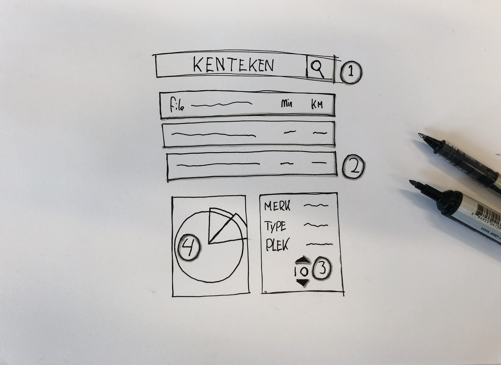
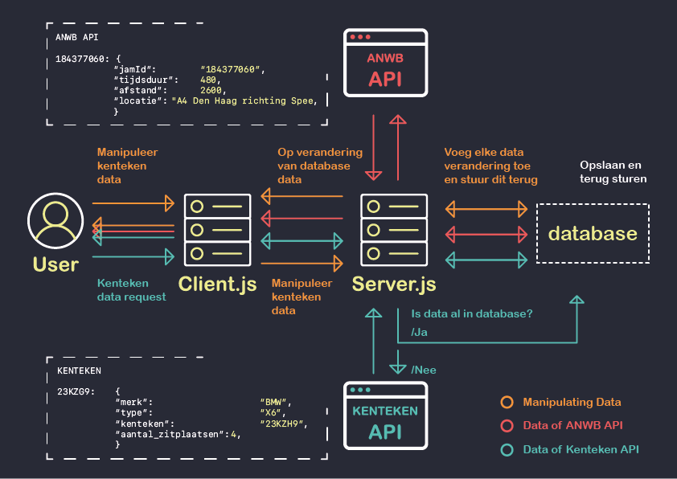

# Real-Time Web @cmda-minor-web · 2018-2019

[DEMO](https://rtwstut.herokuapp.com)

## Concept:

Het idee is om ANWB data op te halen vanaf de [ANWB API bron](https://anwb.nl/feeds/gethf). Deze data bevat alle huidige data over Nederlandse wegen. Zo zit er een collectie data tussen van files, waar ik graag mee wil werken. Ik wil 2 databronnen gaan combineren, namelijk de ANWB data en voertuiggegevens met de API van het [Nederlandse voertuigregister](https://overheid.io/documentatie/voertuiggegevens). Volgens de bron [radio2](https://radio2.be/de-inspecteur/1-kilometer-file-hoeveel-autos) staan er gemiddeld **100 tot 160 auto’s per kilometer file**. Als we uit gaan van **130 auto’s**, kunnen we met een conceptueel idee bedenken hoeveel de file zou verminderen als er gecarpoold werd. Uit de gegevens van het Nederlandse voertuigregister is op te halen hoeveel zitplekken er in een auto zitten. Nu hebben we allemaal wel is meer mensen vervoerd in een auto dan dat er zitplekken zijn, en als we een wat gaan overdrijven kunnen er nog veel meer mensen in. Als we uit gaan van **1 persoon per auto**, kunnen we een berekening gaan maken.

Schets met interactie:

* Punt 1:
In het invulveld wil ik de gebruiker een Nederlands kenteken laten invullen, om deze data op te gaan halen. 

* Punt 2:
Wanneer een kenteken is opgevraagd, worden de huidige files in een lijst weergegeven. Hier moet er een file aangeklikt worden om daar data van te gaan manipuleren.

* Punt 3:
Zodra er een file gekozen is, wordt de specifieke voertuigdata ingeladen. Er is een input field waar het aantal zitplekken verhoogt of verlaagd kan worden. 

* Punt 4: 
In een piechart wordt visueel laten zien hoeveel effect jouw voertuig zou hebben met de huidige manipulaties. Ook manipulaties van andere voertuigen zijn hier in terug te vinden. 

## Datamodel

In bovenstaand datamodel probeer ik de interactie en data visueel samen te vatten. Wanneer een gebruiker een request doet naar een kenteken, wordt dat request naar de **server** gestuurd. Op de **server** wordt er gekeken of dit kenteken al bekend is in de **database**. De database die ik gebruik voor dit project is **Firebase Realtime Database**. De reden dat ik eerst ga kijken of de data in de database zit, is omdat ik maar *500 API requests* kan sturen naar deze API zonder betaling. Wanneer de data nog niet in de **database** zit, wordt deze opgehaald met een **fetch** request. Vervolgens wordt deze data direct gefilterd en naar de **database** gestuurd. 

In de achter wordt er ANWB data opgehaald vanaf de ANWB API. Deze data wordt door de ANWB iedere 3 minuten geüpdatet. Deze data wordt iedere 3 minuten met een interval opgevraagd, en geüpdatet of opgeslagen op de **database**. 

Op het moment dat er data wordt gewijzigd op de **database** wordt er een **socket.emit** gestuurd richting de **client** met de nieuwe data uit de **database**. Wanneer deze **emit** wordt ontvangen op de **client**, wordt de data geüpdatet.

Als de gebruiker voertuigdata wilt aanpassen vanaf de **client**, zal deze met een request naar de **server** gestuurd worden. Deze data gaat vervolgens via de **database** weer terug naar alle verbonden gebruikers met behulp van een **socket verbinding**.

## Op het verlanglijstje:
* Ik heb gebruik gemaakt van een **locatie API**, met deze methode wilde ik de files sorteren van dichtbij tot verder weg. Echter heb ik dit niet meer uit kunnen werken.
* De data op heroku kan soms langzaam ingeladen worden, ik zou er graag achter willen komen hoe dit komt.
* De D3 piechart is afkomstig van [Ruben Barajas](https://codepen.io/RubenBarajas/pen/odNOMe) op codepen. Ik heb nooit eerder gewerkt met D3, en zou dit graag zelf willen kunnen opzetten.
* refactor de code, zodat deze netter opgezet is.

### Met dank aan:
* [Maikel van Veen](https://github.com/Maikxx), voor het helpen uitdenken van een plan van aanpak en menige bug fixes.